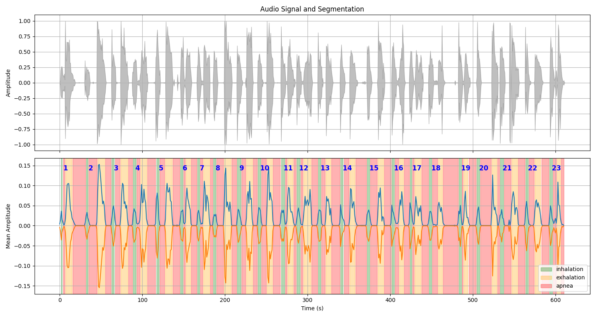

# Mindfulness Through Breathing: Interactive Analysis Tool

[Deployed](http://35.239.174.69/)

This project is a web-based interface for analyzing respiratory patterns from audio recordings. It helps users visualize their breathing, interactively correct detected respiratory phases (inhalation, exhalation, apnea), and receive real-time feedback on their technique based on metrics like depth, stability, and balance.

All analysis results are saved persistently in a local SQLite database, allowing for a durable record of each session.

## Key Features

-   **Audio Upload:** Upload `.wav` audio files of breathing sessions.
-   **Participant Tracking:** Mandatory input for participant name/code, used for organizing results folders and database records.
-   **Audio Playback with Visual Sync:** Play uploaded audio with a synchronized vertical indicator bar on the respiratory phase chart.
-   **Automatic Phase Detection:** The backend analyzes the audio to identify and segment inhalation, exhalation, and apnea phases.
-   **Interactive Charting:**
    -   Visualizes the audio signal and an amplitude envelope plot where respiratory phases are clearly marked.
    -   **Full Phase Editing:** Select, merge, **split**, or delete detected phase blocks directly on the chart.
    -   **Automatic Cycle Re-labeling:** After any edit (split, merge, delete), the entire sequence of phases is automatically re-labeled to enforce the correct `inhalation -> apnea -> exhalation -> apnea` pattern.
    -   All changes instantly update the respiratory cycle table and performance scores.
-   **Configurable Analysis Parameters:**
    -   **Real-time Apnea Threshold:** Adjust the apnea detection threshold and instantly recalculate the phase segmentation.
    -   **Editable Score Metrics:** Open a parameters dialog to change the target values for cycle duration, I/E ratio, and apnea percentage, and instantly recalculate the performance scores.
-   **Real-Time Analysis & Feedback:**
    -   **Respiratory Cycles Table:** Automatically groups phases into complete respiratory cycles and calculates durations.
    -   **Performance Scores:** Provides scores for **Depth**, **Stability**, and **Internal Balance**, plus a final weighted score.
    -   **Personalized Recommendations:** Offers a simple, actionable tip based on the weakest performance area.
-   **Persistent Storage with SQLite:**
    -   Each analysis session is saved as a record in a local **SQLite database** (`mindfulness_analysis.db`).
    -   Interactive changes made in the UI **update the original database record**, ensuring data integrity and preventing duplicate entries.
-   **Comprehensive Data Export:** Export results in multiple formats (`PDF`, `CSV`, `Excel`, `PNG`). The PDF report is a multi-page document including analysis graphs, a full summary table, and the calculated performance scores.
-   **User-Friendly Interface:** Includes a loading indicator during analysis for better user experience.

## How It Works

1.  **Backend (Python & Flask):**
    -   **Audio Processing:** Uses `librosa` to load audio and calculate an amplitude envelope.
    -   **Phase Detection:** A threshold-based algorithm identifies active breathing vs. apnea.
    -   **Data Analysis:** `pandas` is used for structuring and analyzing respiratory cycles.
    -   **Database:** The `sqlite3` module handles all interactions with the local database (creation, insertion, and updates).
    -   **Web Framework:** Flask manages file uploads, serves the frontend, and provides an API endpoint (`/recalculate_table`) for real-time updates.

2.  **Frontend (HTML, CSS, JavaScript):**
    -   **Dynamic Charts:** Uses `Chart.js` with the annotation plugin to create interactive visualizations.
    -   **Audio Playback & Synchronization:** Integrates an audio player with a real-time vertical indicator on the charts, synchronized with audio playback.
    -   **AJAX for Real-Time Updates:** When a user modifies a phase, an asynchronous request is sent to the Flask backend.
    -   **Real-Time Recalculation:** The backend recalculates all metrics and database entries, returning the updated data to the frontend without a page reload.

## Project Structure

```
.
├── analisis_audio.py           # Core logic for audio analysis and respiration metrics.
├── app.py                      # Flask web application (controller).
├── database.py                 # Handles all SQLite database operations.
├── mindfulness_analysis.db     # SQLite database file (created on first run).
├── requirements.txt            # Project dependencies.
├── check_db.py                 # Utility script to view database contents.
├── DetecciónDeFasesRespiratorias.ipynb # Jupyter Notebook for R&D.
├── results/
│   └── ...                     # Each session's output files are saved here.
├── static/
│   ├── css/style.css           # Custom stylesheets.
│   └── js/script.js            # Frontend JavaScript for interactivity.
├── templates/
│   └── index.html              # Main HTML template for the UI.
└── uploads/
    └── ...                     # Uploaded audio files are stored here.
```

## How to Run

1.  **Clone the repository:**
    ```bash
    git clone <repository-url>
    cd <repository-folder>
    ```

2.  **Install dependencies from `requirements.txt`:**
    ```bash
    pip install -r requirements.txt
    ```

3.  **Run the Flask application:**
    ```bash
    python app.py
    ```
    On the first run, this will create the `mindfulness_analysis.db` file.

4.  **Access the application:** Open a web browser and navigate to `http://127.0.0.1:5000`.

## How to Check the Database

You can inspect the contents of the database in two ways:

1.  **Using the provided script:**
    Run the `check_db.py` script to print a summary of all saved sessions to your console.
    ```bash
    python check_db.py
    ```

2.  **Using a DB Browser:**
    Use a graphical tool like [DB Browser for SQLite](https://sqlitebrowser.org/) to open the `mindfulness_analysis.db` file and explore the data visually.

## Example Results

Below is an example of the analysis results from a session.

**Segmentation Chart**

*Note: The image path is an example and may vary based on the session. The colors could change.*


**Respiratory Cycles Table**

| Cycle | Inhalation (s) | Apnea 1 (s) | Exhalation (s) | Apnea 2 (s) | Total Cycle (s) |
|-------|----------------|-------------|----------------|-------------|-----------------|
| 1     | 2.0           | 3.0        | 9.0           | 16.0        | 30.0            |
| 2     | 3.0            | 11.0        | 9.0           | 8.0        | 31.0            |
| ...   | ...            | ...         | ...            | ...         | ...             |
| avg   | 4.0            | 6.1        | 7.6           | 8.8        | 26.5            |


**Data for Machine Learning**

For each session, a `segmentation_data.json` file is also generated. This file is designed for use in machine learning pipelines and contains the audio metadata and a list of all detected respiratory events.

```json
{
            "id": "cycle_23",
            "start": 575,
            "end": 599,
            "label": "23",
            "cycle_number": 23
        },
        {
            "id": "cycle_24",
            "start": 600,
            "end": 610,
            "label": "24",
            "cycle_number": 24
        }
    ],
    "db_id": 1,
    "session_folder": "results\\Test1_10-junio-4.14-am_20250821-120438",
    "audio_filename": "10-junio-4.14-am.wav"
}
```


## 🧭 Use Guide

- 🔧 [Local Installation](docs/LOCAL_DEPLOYMENT.md)
- 🚀 [Deploy with Docker](docs/PRODUCTION_DEPLOYMENT.md)